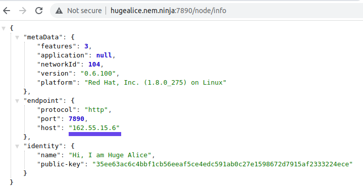
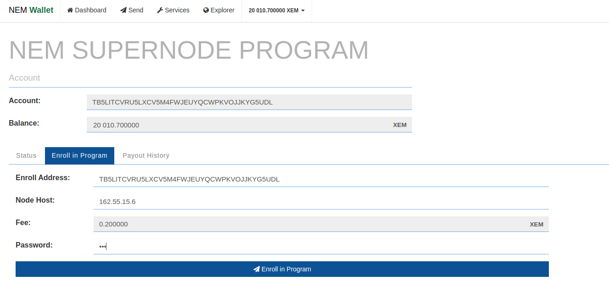

## About Supernodes

The NEM Supernode's Program is funded with XEM set aside during the Nemesis block. These rewards are then given to high performance nodes for helping to secure the network. These nodes form a backbone of support for light wallets, mobile wallets, and 3rd party apps so that users of these services might have access to the network that is easy, fast, and reliable without having to sync a blockchain by themselves or use untrustworthy centralized services.

The NEM network has been designed from the very beginning with the goal in mind that any light client can securely connect to and use any server safely to make any transaction. Supernodes are expected to be high performance and reliable nodes. They are regularly tested on their bandwidth, chain height, chain parts, computing power, version, ping, and responsiveness to make sure that they are performing to high standards. If they meet all these requirements, they are randomly given rewards.

## Steps to Enroll and Participate in Supernodes

- **Step 1**: Download and run NEM Wallet from [the GitHub releases page](https://github.com/NemProject/NanoWallet/releases).

  You can find tutorials on how to use NEM Wallet [here](https://nemproject.github.io/nem-docs/pages/Guides/nanowallet/docs.en.html).

- **Step 2**: Make an account and have at least 10,010 XEM.

  10,000 XEM to be able to participate in the Program, and ~10 XEM to be able to pay the fees for activating delegated harvesting and sending the enrollment message. (You have to re-enroll in the Program every month - 10 XEM should be enough to cover fees for at least a year.)

- **Step 3**: Activate delegated harvesting on your main account.

  The tutorial for NEM Wallet delegated harvesting can be found [here](https://nemproject.github.io/nem-docs/pages/Guides/nanowallet/delegated-harvesting/docs.en.html).
  
  Remember, 6 hours must pass before you can start harvesting, but for the sake of Supernodes, once you have the delegated private key (which is available instantly), you may proceed. (Please make sure to get the private key from the **delegated** harvesting account, not your main account and not either of the public keys.)
  
  To find your **delegated** private key go to Services -> Delegated Harvesting -> Manage delegated account. Choose "Show delegated account keys", and put the password to reveal the delegated private key.

- **Step 4**: If you don't have a NIS node, you need to set up it first. The tutorial can be found [here](https://nemproject.github.io/nem-docs/pages/Guides/node-operation/docs.en.html).

- **Step 5**: Shut down the NIS node, if running.

- **Step 6**: Configure your NIS node to autoboot with the **delegated** private key.

  You will need to edit the config file in your NIS folder to do this. Here is some help:

  When you unzipped the standalone you made a folder called ``package``. Open that folder and double-click on the folder ``nis`` and then open the file ``config.properties`` with a text editor. You need to find line which says ``#nis.bootKey =``. Now delete the "#" so it only says ``nis.bootKey =``. Next delete ``#0123456789abcdef0123456789abcdef0123456789abcdef0123456789abcdef`` and replace it with your delegate private key from Step 3.

  In the next line (``#nis.bootName``), remove the "#" and then erase "foobar" and instead write the name of your node. Any name is fine. Lastly, make sure that ``nis.shouldAutoHarvestOnBoot`` is set to ``true``.

  Optionally (node will try to autodetect IP automatically if not defined), you can define your domain or IP using ``nem.host`` property.

  

  Save your edits and close the text editor.

  To test if you have done this correctly restart your node. If you have followed all steps correctly, you will see that your NIS is booting and synchronizing automatically.

- **Step 7**: Download the [node servant](https://bob.nem.ninja/servant_0_0_4.zip).
  
  This is a very light application that will run 24/7 on the same machine as your NIS to perform tests and monitor the network.

- **Step 8**: Configure the servant.

  Unzip and open the folder ``servant``. Open the file ``config.properties`` with a text editor. In your text editor enter your static IP or domain name for the ``nem.host`` field. (It is important that your domain name or static IP associated with your node is fixed for the stability of the network.) Then in the field ``servant.key`` enter your delegated private key from Step 3. (Again make sure to use your delegated private key and not your main account private key.) Save your edits and close the text editor.

  

- **Step 9**: Open inbound/outbound TCP ports 7890 (NIS), 7880 (servant), and 7778 (websocket for NEM Wallet).

  Opening 7890 allows your node to be a full node and contribute to the network. If you were successful you will see your node's name appear on [Explorer](https://explorer.nemtool.com/#/nodelist). This might take a while to appear.

  Opening port 7880 is required to allow the servant to work correctly.

  Port 7778 allows light wallets to connect to the server.

- **Step 10**: Start NIS, let it synchronize, and then start the servant.

  To start the servant double-click on ``runservant.bat`` in the ``servant`` folder. (In Mac or Linux navigate to the file in terminal and use the command ``sh startservant.sh``. It's recommended to run in background using ``screen`` or ``nohup`` command.)

- **Step 11**: Enroll in the Program using NEM Wallet.

  Go to Services -> SuperNode Program -> Check & Enroll in Program -> Enroll in Program, put the enrollment address for current month (announced via official Twitter and Discord) and your node host for your node. Send enrollment transaction.
  Make sure host matches your node host from ``/node/info`` endpoint response.

  

  

  To breathe life into NEM, the new program will require monthly re-enrollments in order to increase engagements.
  Prior to the month-end, a new enrollment address will be announced by [Twitter account](https://twitter.com/nemofficial) and [Discord](https://www.discord.gg/xymcity).
  The node operator has to re-enroll each month using a new enrollment address. Enrollment for the next month is available 4 days before the end of the preceding month.

  As an alternative, you can send enroll transaction manually. It should be transfer transaction with message ``enroll <NODE_HOST> <CODEWORD_HASH>`` to current enrollment address. As a ``<NODE_HOST>`` should be used host from ``/node/info`` endpoint. Current ``<CODEWORD_HASH>`` can be fetched for specific account by public key using Supernode API ``https://supernodesapi.nem.io/codeword/<public_Key>``.

- **Step 12**: Review your results at [nem.io/supernodes](https://nem.io/supernodes) to make sure that your node is passing all the tests. Please be patient, since your results will not be visible immediately.

## Editing Your Supernode IP/Domain

Some node admins will need to change the IP address from time to time as they move hosting services. Or at some point, a node admin might want to change their node name.

In such a case, you have to modify node configuration and re-send enrollment (Step 11) with a changed IP/Domain.